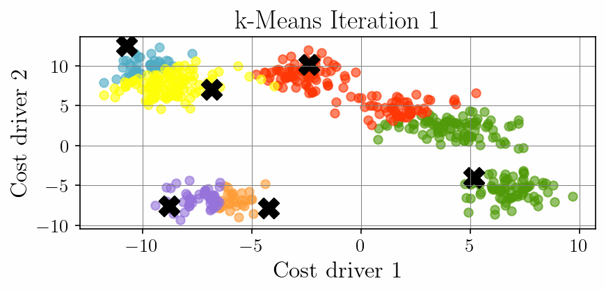

# Cost Optimization through k-Means Clustering of Cost Drivers

This project implements a PyTorch-based k-Means clustering solution for identifying cost driver patterns in industrial settings. The framework automatically groups similar cost factors, enabling targeted optimization strategies. The implementation features a complete pipeline from synthetic data generation to animated visualization of the clustering process, providing intuitive insights into how cost drivers naturally form clusters in high-dimensional spaces. The animation showcases the iterative centroid optimization process, making the algorithm's behavior transparent and interpretable for cost analysis applications.

<p align="center">
  
</p>

---

## 🏦 Repository Structure

```
.
├── dataset.py # Synthetic cost driver data generator
├── kmeans.py # PyTorch k-Means implementation
├── evaluate.py # Clustering evaluation functions
├── config_plots.py # Visualization configuration
├── main.py # Main clustering and animation script
├── kmeans_frames/ # Temporary animation frames
├── cost_driver_clusters.png # Final clustering visualization
├── kmeans_clustering.gif # Animation of clustering process
├── README.md # This file
└── requirements.txt # Python dependencies
```

---

## 🧩 Installation

1. Clone the repository:

```bash
git clone https://github.com/Diyarino/cost-optimization-kmeans.git
cd cost-optimization-kmeans
```

2. (Optional) Create and activate a virtual environment:

```bash
python -m venv venv
source venv/bin/activate  # Linux/macOS
venv\Scripts\activate     # Windows
```

3. Install dependencies:

```bash
pip install -r requirements.txt
```

---

## 🔧 Usage

Run the main script to train both models and generate evaluation plots:

```bash
python main.py
```

The script will:
* Generate synthetic cost driver data (7 natural clusters)
* Perform k-Means clustering (6 target clusters)
* Evaluate clustering quality with the silhouette score
* Save a static visualization of the final clusters
* Create an animated GIF of the clustering process

---

## 📦 Dependencies

* Python 3.8+
* numpy
* matplotlib
* scikit-learn
* torch (PyTorch)
* tqdm

You can install all with:

```bash
pip install numpy matplotlib scikit-learn torch tqdm
```

---

## 📚 Related Projects 

Below are selected related works and projects that inspired or complement this research:

<a id="1">[1]</a> Altinses, D., & Schwung, A. (2023, October). Multimodal Synthetic Dataset Balancing: A Framework for Realistic and Balanced Training Data Generation in Industrial Settings. In IECON 2023-49th Annual Conference of the IEEE Industrial Electronics Society (pp. 1-7). IEEE.

<a id="2">[2]</a> Altinses, D., & Schwung, A. (2025). Performance benchmarking of multimodal data-driven approaches in industrial settings. Machine Learning with Applications, 100691.

<a id="3">[3]</a> Altinses, D., & Schwung, A. (2023, October). Deep Multimodal Fusion with Corrupted Spatio-Temporal Data Using Fuzzy Regularization. In IECON 2023-49th Annual Conference of the IEEE Industrial Electronics Society (pp. 1-7). IEEE.

<a id="3">[4]</a> Altinses, D., Torres, D. O. S., Lier, S., & Schwung, A. (2025, February). Neural Data Fusion Enhanced PD Control for Precision Drone Landing in Synthetic Environments. In 2025 IEEE International Conference on Mechatronics (ICM) (pp. 1-7). IEEE.

<a id="3">[5]</a> Torres, D. O. S., Altinses, D., & Schwung, A. (2025, March). Data Imputation Techniques Using the Bag of Functions: Addressing Variable Input Lengths and Missing Data in Time Series Decomposition. In 2025 IEEE International Conference on Industrial Technology (ICIT) (pp. 1-7). IEEE.

